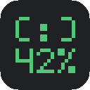
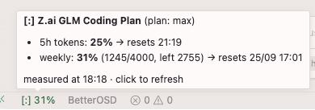

#  zai-cursor-limit

Traffic light for z.ai GLM Coding Plan quotas, for Cursor (and any VS Code fork).

> Unofficial community tool — not affiliated with Z.ai. Uses an undocumented
> usage endpoint; it may change without notice.

## Install

One-liner (always the latest release):

```bash
curl -LO https://github.com/0x3654/zai-cursor-limit/releases/latest/download/zai-cursor-limit.vsix \
  && cursor --install-extension zai-cursor-limit.vsix
```

Or grab the vsix manually from
[the latest release](https://github.com/0x3654/zai-cursor-limit/releases/latest).

(or Extensions panel → `…` → *Install from VSIX*). Works in Cursor and any
VS Code fork ≥ 1.84; zero dependencies, plain JS, no build step.

## What you see



A status bar item — `[:] 31%` with the robot face in the level color:

- the number is the larger of the two quota windows by default (5-hour token
  window vs the weekly quota); `statusbarMetric` can pin it to `5h` or `weekly`
- the text color follows the level: **green** below the yellow threshold
  (default 50%), **yellow** ≥ 50%, **red** ≥ 90% — thresholds are settings;
  the level is always computed from the **max** of both windows, even when
  the displayed number is pinned to `5h`/`weekly`
- hover for the full picture: both percentages, window reset times,
  used/quota of the weekly window, plan tier, measurement time
- click refreshes (opens the settings only while the api key is missing); auto-refresh every `refreshSec`
  (default 300 s, min 30)

On request failures the bar keeps the most recent data with a warning sign
(`[:] ⚠ 31%`), the tooltip names the error and the data timestamp, and the
extension retries every 5 s until a request succeeds.

Optional per color level: a title bar tint (deep colors, white title text
enforced so it stays readable). Off levels simply clear the tint.

## Settings

Grouped into blocks: **General** → **Robot Text Color** (switches, hex) →
**Thresholds (%)** → **Title Bar Tint** (switches, hex). Color entries are
ordered green → yellow → red.

| Key | Default | Effect |
|---|---|---|
| `zaiCursorLimit.apiKey` | — | API key (the `ANTHROPIC_AUTH_TOKEN` value works) |
| `zaiCursorLimit.statusbarEnabled` | `true` | indicator in the status bar; off also resets all colors |
| `zaiCursorLimit.refreshSec` | `300` | refresh interval, sec (min. 30) |
| `zaiCursorLimit.statusbarMetric` | `max` | which number the bar shows: `max` / `5h` / `weekly` (color always follows the max) |
| `zaiCursorLimit.yellowPct` | `50` | yellow threshold, % |
| `zaiCursorLimit.redPct` | `90` | red threshold, % |
| `zaiCursorLimit.colorRobotOn{Green,Yellow,Red}` | `true` | per-level text coloring |
| `zaiCursorLimit.<color>Text{Dark,Light}` | see below | robot text hex per theme kind |
| `zaiCursorLimit.tintTitlebarOn{Green,Yellow,Red}` | green off, yellow/red on | per-level title bar tint |
| `zaiCursorLimit.<color>Tint{Dark,Light}` | see below | title bar tint hex per theme kind |

Built-in palette (HSL saturation ~50%; text: L~55% on dark / L~25% on light;
tints: `#339955` green / `#8A7228` amber / `#862D3B` wine, same on both
themes): every one of the 12 hexes is a setting, and the palette half is
re-picked live when the theme switches. The inactive title bar shade is
derived (tint × 0.85).

## Commands

- `Z.ai: refresh quota now` — also shows a quick notification
- `Z.ai: open usage dashboard` — the z.ai coding-plan usage page
- `Z.ai: test thresholds (fake percentages)` — render 10/55/95 % to check colors
- `Z.ai: reset colors` — drop every color override we own

## Technical notes

- Data comes from the undocumented endpoint
  `GET https://api.z.ai/api/monitor/usage/quota/limit` — it may change without
  notice. In `TIME_LIMIT` the `usage` field is the quota size and
  `currentValue` is the consumption.
- `StatusBarItem.backgroundColor` is whitelist-only and does not render in
  Cursor, so the traffic light colors the item **text** — the `.color` property
  accepts raw hex with no whitelist.
- The extension owns its `workbench.colorCustomizations` keys unconditionally
  (titleBar/statusBar overrides): apply/restore strip everything it owns from
  the current value and re-add what is wanted, so stale tints cannot survive
  reloads. Non-managed user keys are never touched.
- Color writes survive a dirty `settings.json` (VS Code blocks writes to a
  file with unsaved editor changes): one warning, tooltip marker, retried on
  the next tick.

## Build (in a container)

```bash
docker run --rm -v "$PWD":/src -w /src node:22-alpine \
  sh -c "npm i -g @vscode/vsce && vsce package -o zai-cursor-limit.vsix"
```

The icon (`icon.png`, `[:] 42%` pixel badge) is generated with
`node scripts/make_icon.js` — zero dependencies.

## Release

Bump `version` in package.json, commit, then `./scripts/release.sh` — it tags
`v<version>` from package.json (signed) and pushes the tag; the workflow
builds the vsix and attaches it to the GitHub Release.
